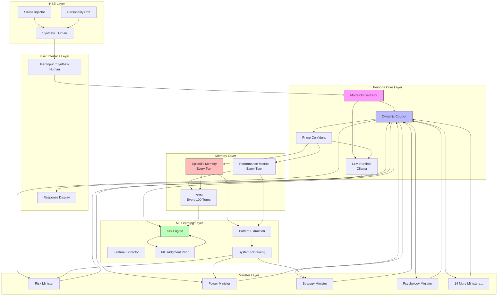
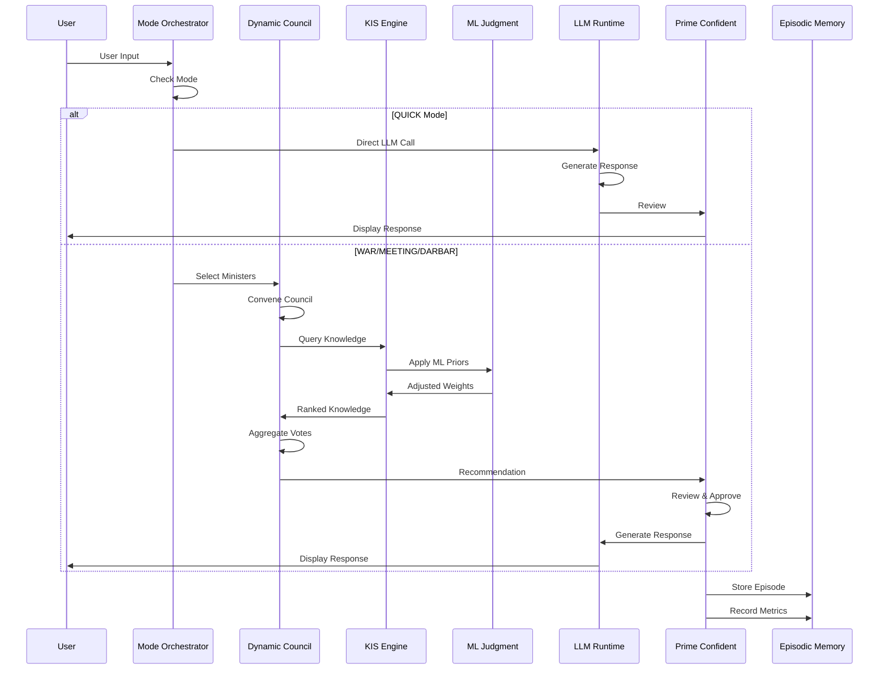
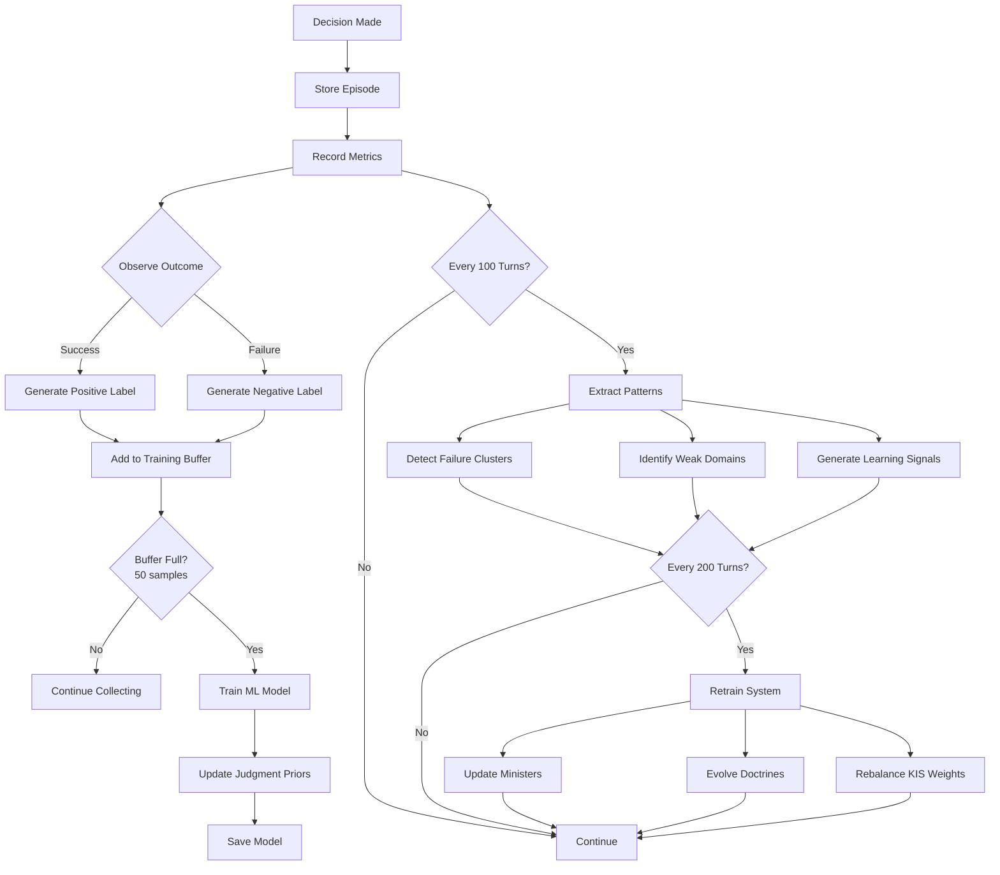
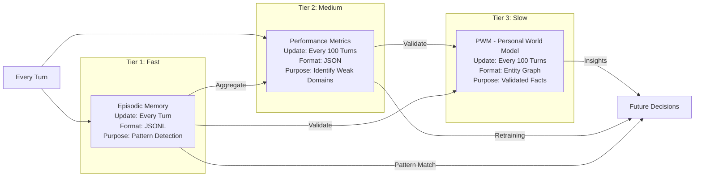
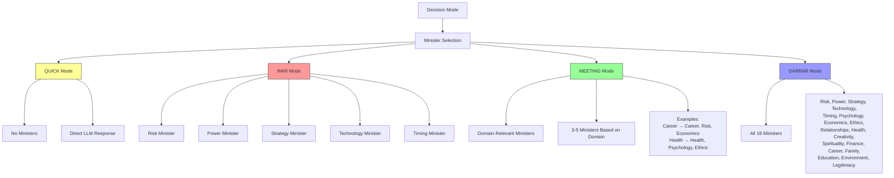
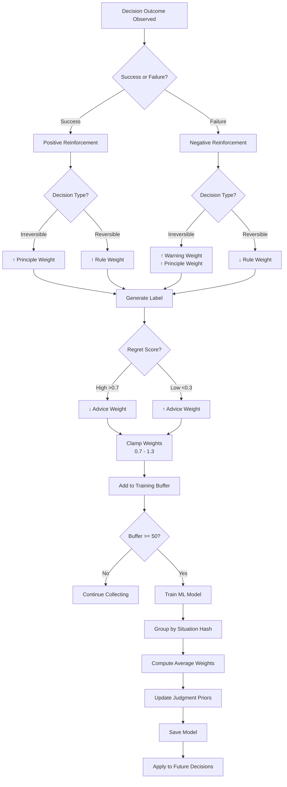

```mermaid
gantt
    title System Progression Through Phases
    dateFormat X
    axisFormat %L turns
    
    section Phase 1
    Infrastructure (0-100)     :0, 100
    Init Episodic Memory       :0, 20
    Init Performance Metrics   :0, 20
    Init Synthetic Human       :0, 20
    Record First 100 Turns     :0, 100
    
    section Phase 2
    Learning Loop (100-300)    :100, 200
    Activate Feedback Loop     :100, 120
    Activate Conversation Arc  :100, 120
    Activate Identity Validator:100, 120
    Enable Failure Analysis    :100, 150
    
    section Phase 3
    Optimization (300-700)     :300, 400
    Activate Mode Validator    :300, 320
    Activate Failure Analysis  :300, 350
    System Retraining (200)    :300, 700
    Extract Success Patterns   :300, 400
    
    section Phase 4
    Stress Testing (700-1000+) :700, 300
    Activate Stress Scenarios  :700, 750
    Measure Response Quality   :700, 1000
    Monitor Trust Trajectory   :700, 1000
    Dashboard Reports          :700, 1000
```

# 05_FLOWCHARTS.md

# 📊 Era Project - Visual Flowcharts

**System diagrams in Mermaid and ASCII format**

---

## 1. Complete System Architecture

### Mermaid Diagram



---

## 2. Decision Pipeline Flow

### Mermaid Diagram



---

## 3. Learning Pipeline Flow

### Mermaid Diagram



---

## 4. Memory Architecture Flow

### Mermaid Diagram



---

## 5. Mode Selection Flow

### ASCII Diagram

```
                    ┌─────────────────────────┐
                    │   User Types Input      │
                    └───────────┬─────────────┘
                                │
                                ▼
                    ┌─────────────────────────┐
                    │   Starts with "/mode"?  │
                    └───────────┬─────────────┘
                                │
                ┌───────────────┴───────────────┐
                │                               │
               YES                              NO
                │                               │
                ▼                               ▼
    ┌───────────────────────┐       ┌───────────────────────┐
    │  Parse Mode Command   │       │  Get Current Mode     │
    │  /mode quick|war|     │       │  (from state)         │
    │  meeting|darbar       │       └───────────┬───────────┘
    └───────────┬───────────┘                   │
                │                               │
                ▼                               │
    ┌───────────────────────┐                   │
    │  Validate Mode        │                   │
    │  - Check valid        │                   │
    │  - Load ministers     │                   │
    │  - Update state       │                   │
    └───────────┬───────────┘                   │
                │                               │
                ▼                               │
    ┌───────────────────────┐                   │
    │  Display Confirmation │                   │
    │  "Switched to WAR     │                   │
    │   Ministers: Risk,    │                   │
    │   Power, Strategy..." │                   │
    └───────────┬───────────┘                   │
                │                               │
                └───────────────┬───────────────┘
                                │
                                ▼
                    ┌─────────────────────────┐
                    │   Route Decision        │
                    │   Based on Mode         │
                    └───────────┬─────────────┘
                                │
            ┌───────────────────┼───────────────────┐
            │                   │                   │
            ▼                   ▼                   ▼
    ┌───────────────┐   ┌───────────────┐   ┌───────────────┐
    │    QUICK      │   │  WAR/MEETING  │   │    DARBAR     │
    │               │   │    /DARBAR    │   │               │
    │ Direct LLM    │   │ Council       │   │ Full Council  │
    │ No Ministers  │   │ 3-5 Ministers │   │ 18 Ministers  │
    │ Fast (1-2s)   │   │ Medium (10s)  │   │ Slow (30s+)   │
    └───────────────┘   └───────────────┘   └───────────────┘
```

---

## 6. Minister Selection by Mode

### Mermaid Diagram



---

## 7. KIS Weight Calculation

### ASCII Diagram

```
                    ┌─────────────────────────┐
                    │   Knowledge Entry       │
                    │   (from data/ministers) │
                    └───────────┬─────────────┘
                                │
                                ▼
                    ┌─────────────────────────┐
                    │   Compute 5 Weights     │
                    └───────────┬─────────────┘
                                │
        ┌───────────────────────┼───────────────────────┐
        │                       │                       │
        ▼                       ▼                       ▼
┌───────────────────┐ ┌───────────────────┐ ┌───────────────────┐
│  Domain Weight    │ │   Type Weight     │ │  Memory Weight    │
│  (0.25 - 1.4)     │ │   (0.9 - 1.1)     │ │  (1.0 - 8.0)      │
│                   │ │                   │ │                   │
│ If domain active: │ │ Principle: 1.0    │ │ Formula:          │
│   max(conf, 0.5)  │ │ Rule: 1.1         │ │ (1 + ln(1 + rc))  │
│ Else: 0.25        │ │ Warning: 1.05     │ │ × exp(-0.3 × pc)  │
│                   │ │ Claim: 0.95       │ │                   │
│                   │ │ Advice: 0.9       │ │ rc = reinforcement│
│                   │ │                   │ │ pc = penalty      │
└───────────────────┘ └───────────────────┘ └───────────────────┘
        │                       │                       │
        └───────────────────────┴───────────────────────┘
                                │
        ┌───────────────────────┴───────────────────────┐
        │                                               │
        ▼                                               ▼
┌───────────────────┐                         ┌───────────────────┐
│  Context Weight   │                         │   Goal Weight     │
│  (0.85 - 1.4)     │                         │   (0.7 - 1.2)     │
│                   │                         │                   │
│ 2+ keyword match: │                         │ Strategic lang:   │
│   1.4             │                         │   1.2             │
│ 1 match: 1.2      │                         │ Tactical: 1.0     │
│ 0 matches: 0.85   │                         │ Operational: 0.7  │
└───────────────────┘                         └───────────────────┘
        │                                               │
        └───────────────────────┬───────────────────────┘
                                │
                                ▼
                    ┌─────────────────────────┐
                    │   KIS Score = Product   │
                    │                         │
                    │   domain × type ×       │
                    │   memory × context ×    │
                    │   goal                  │
                    └───────────┬─────────────┘
                                │
                                ▼
                    ┌─────────────────────────┐
                    │   Rank All Entries      │
                    │   Return Top 5-10       │
                    └─────────────────────────┘
```

---

## 8. Outcome-Based Learning Flow

### Mermaid Diagram



---

## 9. Validation Layer Flow

### ASCII Diagram

```
┌─────────────────────────────────────────────────────────────┐
│                    VALIDATION LAYERS                         │
└─────────────────────────────────────────────────────────────┘

Response Generated
    │
    ▼
┌─────────────────────────────────────────────────────────────┐
│  Mode Validator                                              │
│  ├─ Check: Response matches mode?                           │
│  ├─ QUICK: Personal, direct, no council refs?               │
│  ├─ WAR: Victory-focused language?                          │
│  ├─ MEETING: Multi-perspective synthesis?                   │
│  └─ DARBAR: Full council involvement?                       │
│                                                              │
│  If FAIL: Correct mode violation → Regenerate               │
└─────────────────────────────────────────────────────────────┘
    │
    ▼
┌─────────────────────────────────────────────────────────────┐
│  Identity Validator                                          │
│  ├─ Check: Self-contradiction?                              │
│  ├─ Compare with past statements                            │
│  ├─ Check doctrine alignment                                │
│  └─ Enforce red lines (no fraud, deception, harm)           │
│                                                              │
│  If FAIL: Flag contradiction → Force acknowledgment         │
└─────────────────────────────────────────────────────────────┘
    │
    ▼
┌─────────────────────────────────────────────────────────────┐
│  Conversation Arc Validator                                  │
│  ├─ Check: Narrative coherence?                             │
│  ├─ Remember past decisions                                 │
│  ├─ Detect circular loops                                   │
│  └─ Maintain story continuity                               │
│                                                              │
│  If FAIL: Summarize arc → Redirect conversation             │
└─────────────────────────────────────────────────────────────┘
    │
    ▼
┌─────────────────────────────────────────────────────────────┐
│  Prime Confident Final Review                                │
│  ├─ Approve: Send to user                                   │
│  ├─ Reject: Override with alternative                       │
│  └─ Modify: Adjust and send                                 │
└─────────────────────────────────────────────────────────────┘
    │
    ▼
Response Displayed to User
```

---

## 10. 4-Phase System Progression

### Mermaid Diagram



---

## 11. Complete End-to-End Flow

### ASCII Diagram (Full System)

```
┌─────────────────────────────────────────────────────────────────────────┐
│                         COMPLETE END-TO-END FLOW                         │
└─────────────────────────────────────────────────────────────────────────┘

USER INPUT
    │
    ├───→ [1. LLM Handshakes] ─────────────────────────────────────┐
    │       ├─ Situation: decision_type, risk_level, etc.          │
    │       ├─ Constraints: irreversibility, fragility, etc.       │
    │       ├─ Counterfactuals: 3 options with consequences        │
    │       └─ Intent: goal_orientation, emotional_pressure        │
    │                                                               │
    ├───→ [2. Mode Orchestrator] ──────────────────────────────────┤
    │       ├─ Check: /mode command?                               │
    │       ├─ Get current mode: QUICK/WAR/MEETING/DARBAR          │
    │       └─ Route decision accordingly                          │
    │                                                               │
    ├───→ [3. Minister Selection] ─────────────────────────────────┤
    │       ├─ QUICK: No ministers                                 │
    │       ├─ WAR: 5 ministers (Risk, Power, Strategy, Tech, Time)│
    │       ├─ MEETING: 3-5 domain-relevant ministers              │
    │       └─ DARBAR: All 18 ministers                            │
    │                                                               │
    ├───→ [4. KIS Engine] ─────────────────────────────────────────┤
    │       ├─ Load knowledge from data/ministers/                 │
    │       ├─ Compute 5 weights per entry                         │
    │       ├─ Apply ML judgment priors                            │
    │       └─ Rank and return top 5-10 entries                    │
    │                                                               │
    ├───→ [5. Council Convening] ──────────────────────────────────┤
    │       ├─ Each minister reviews knowledge                     │
    │       ├─ Cast vote with confidence score                     │
    │       ├─ Aggregate recommendations                           │
    │       └─ Compute consensus strength                          │
    │                                                               │
    ├───→ [6. Prime Confident Review] ─────────────────────────────┤
    │       ├─ Check doctrine alignment                            │
    │       ├─ Enforce red lines                                   │
    │       ├─ Approve/Reject/Modify                               │
    │       └─ Final recommendation                                │
    │                                                               │
    ├───→ [7. Response Generation] ────────────────────────────────┤
    │       ├─ LLM (qwen3:14b) generates natural response          │
    │       ├─ Include mode framing                                │
    │       ├─ Include minister input (if council used)            │
    │       └─ Display to user                                     │
    │                                                               │
    └───→ [8. Learning Pipeline] ──────────────────────────────────┤
            ├─ Store episode (Episodic Memory)                     │
            ├─ Record metrics (Performance Metrics)                │
            ├─ Observe outcome (success/failure, regret)           │
            │                                                       │
            ├─ Every Turn:                                         │
            │   └─ Update metrics, store episode                   │
            │                                                       │
            ├─ Every 50 Samples:                                   │
            │   └─ Train ML model, update judgment priors          │
            │                                                       │
            ├─ Every 100 Turns:                                    │
            │   ├─ Extract patterns (failure clusters, etc.)       │
            │   ├─ Validate → Sync PWM                             │
            │   └─ Generate periodic report                        │
            │                                                       │
            └─ Every 200 Turns:                                    │
                ├─ Retrain ministers per domain                    │
                ├─ Evolve doctrines from patterns                  │
                └─ Rebalance KIS weights                           │
                                                                    │
┌───────────────────────────────────────────────────────────────────┘
│
▼
NEXT TURN (Repeat)
```

---

## 12. Component Interaction Matrix

```
┌──────────────────┬─────────┬─────────┬─────────┬─────────┬─────────┐
│                  │  MODE   │ COUNCIL │   KIS   │  MEMORY │   ML    │
├──────────────────┼─────────┼─────────┼─────────┼─────────┼─────────┤
│ MODE             │    -    │   READ  │   READ  │  WRITE  │  WRITE  │
├──────────────────┼─────────┼─────────┼─────────┼─────────┼─────────┤
│ COUNCIL          │   READ  │    -    │   READ  │  WRITE  │  WRITE  │
├──────────────────┼─────────┼─────────┼─────────┼─────────┼─────────┤
│ KIS              │   READ  │   READ  │    -    │  WRITE  │  READ   │
├──────────────────┼─────────┼─────────┼─────────┼─────────┼─────────┤
│ MEMORY (Episode) │  WRITE  │  WRITE  │  WRITE  │    -    │  READ   │
├──────────────────┼─────────┼─────────┼─────────┼─────────┼─────────┤
│ ML               │  WRITE  │  WRITE  │  WRITE  │  READ   │    -    │
└──────────────────┴─────────┴─────────┴─────────┴─────────┴─────────┘

Legend:
  READ  = Component reads from this system
  WRITE = Component writes to this system
  -     = No direct interaction
```

---

## 13. Data Size Over Time

### ASCII Chart

```
Storage Growth (KB)
    │
1000│                                                       ░░░░░░
    │                                                   ░░░░░░
 800│                                               ░░░░░░
    │                                           ░░░░░░
 600│                                       ░░░░░░
    │                                   ░░░░░░
 400│                               ░░░░░░
    │                           ░░░░░░
 200│                       ░░░░░░
    │                   ░░░░░░
   0│───────────────░░░░░░
    │
    └───────┬───────┬───────┬───────┬───────┬───────┬───────┬───────
           100     200     300     400     500     600     700     800
                              Turns

Legend:
  ░░░ = Total Storage (Episodic + Metrics + PWM + ML Models)
  
  At 1000 turns: ~600 KB
  At 10000 turns: ~6 MB
```

---

## 14. Success Rate Improvement Trajectory

### ASCII Chart

```
Success Rate (%)
    │
100 │                                                           ████
    │                                                       ████
 80 │                                                   ████
    │                                               ████
 60 │                                           ████
    │                                       ████
 40 │                                   ████
    │                               ████
 20 │                           ████
    │                       ████
  0 │───────────────────████
    │
    └───────┬───────┬───────┬───────┬───────┬───────┬───────┬───────
           100     200     300     400     500     600     700     800
                              Turns

Phase 1: 45% (turns 0-100)
Phase 2: 55-60% (turns 100-300)
Phase 3: 68-75% (turns 300-700)
Phase 4: 80-85%+ (turns 700-1000+)

Demonstrated: +16.7% improvement (66.7% → 83.4%)
```

---

📄 **Next:** [`06_DEPLOYMENT_GUIDE.md`](./06_DEPLOYMENT_GUIDE.md) - Setup and running the system
